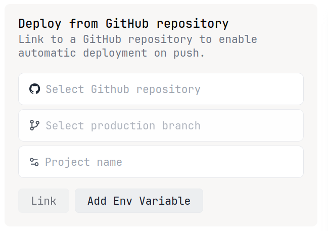
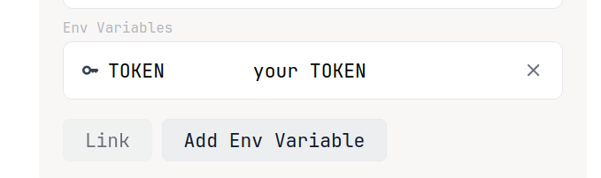
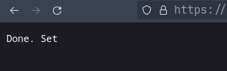

# denonent

[denonent/serve.ts](./serve.ts) is written by [Katsuki Yuri](https://github.com/katsuki-yuri/)

## Usage
### Fork this repository.
And login with your Github account on [Deno Deploy](https://deno.com/deploy)

### Create a new Deno project on deno deploy.
<br>



Choose your repo and branch.


### Add env variable
<br>



## Then press the Link button.
<br>

# Webhook
Simply send HTTP Request to /webhook URL.
Example
```
https://denonent.deno.dev/webhook
```
Result <br>



Now your bot is working. If it's not, feel free to create an issue or join our [Telegram Group](https://t.me/denolanduz)